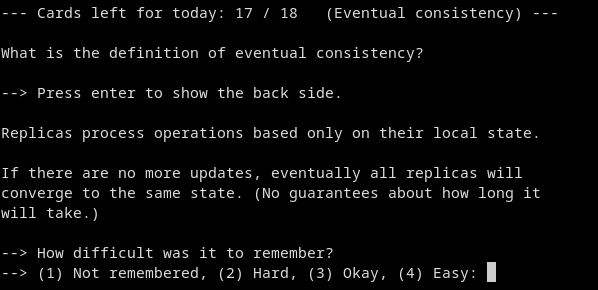
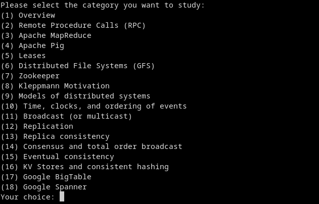

# Markdown Flashcards (`mdfc`)

Easily create and study flashcards using a markdown file and `mdfc`. The command allows you to learn in the terminal through spaced repetition.



If you have worked with Anki before (especially across multiple platforms), you might know how tedious it can be to create flashcards, to tag them, to format them, and also to browse them. I don't want to get overwhelmed by the tool. I just want to reliably learn stuff that is not simple vocabulary. And what could be easier than writing questions and answers in a markdown file?



## Features

- Just plain markdown
- An adapted Leitner system with 4 difficulty levels instead of a binary system
- The ability to study cards from one topic or all topics at once
- The option to study cards in sequential or random order
- Test mode, which allows you to test yourself with a number of random cards

## Markdown Schema

`mdfc` automatically creates and updates the metadata of your flashcards. The following schema shows how the metadata is stored in the file:

```
# <category>

## <front_side>

<back_side>
```

An example file could look like the following. And btw, if you use a proper Markdown editor the file won't look so messy anymore thanks to the syntax highlighting 🌈

```
# 11 Broadcast (or multicast)

## Why do broadcast algorithms differentiate between receiving and delivering?

Because between the network and the application there lies the broadcast algorithm as a middleware. The algorithm decides, whether a message which the node received is forwarded (i.e. delivered) to the application.

The same applies to the send. An application only sees the broadcast call but the middleware then spreads it into multiple point-to-point messages.

## Which types of reliable broadcast are there?

- FIFO broadcast
- Causal broadcast
- Total order broadcast
- FIFO-total order broadcast
```

## Installation

Make sure you have Go installed.

- Clone this repository (`git clone git@github.com:bttger/markdown-flashcards.git`)
- Build the executable (`cd markdown-flashcards && go build -o mdfc`)
- (Optional) Move the executable to a directory that is in your `PATH`. On Linux, you can use the following command: `sudo mv mdfc /usr/local/bin`.
- You can now run the command `mdfc` (or `./mdfc` if you have not added the executable to your environment) in your terminal.

```bash
# Run the executable
$ mdfc ./path/to/flashcards.md
$ mdfc -h
Usage: mdfc [options] [file]

Options:

	-h, --help
		Show this help message and exit.

	-s, --sequential
		Show flashcards in sequential order as in the markdown file. The default behavior is to
		show flashcards in random order.

	-o, --show-category
		Show the category of each flashcard.

	-c, --category <category>
		Show only flashcards of the specified category. A category is a first-level heading in the
		markdown file. A category can be specified by a case-insensitive prefix of the heading.
		If no category is specified, you can interactively choose one.

	-t, --test <number_flashcards>
		Test yourself in test mode with random flashcards. If no number is specified, all
		flashcards will be shown. Possible to combine with -c, --category.

	-n, --number <number_flashcards>
		Learn n cards during the session. Set it to 0 to study all cards that are due to today.
		Defaults to 20.

	-f, --future-days-due <days>
		Usually a flashcard is due on a particular date. If you want to learn flashcards
		before they are due, you can specify the number of days in the future when a flashcard
		should be due. This might be helpful in the case when you have no cards due for today's
		learning session. Cards where the due date was missed will be added anyway. Defaults to 0.

	-w, --wrap-lines <line_length>
		Wrap lines to a maximum length. Only breaks lines at whitespaces. Defaults to terminal width.

	--share-file
		Creates a copy of the flashcard file with the suffix '.share.md'. This file resets the
		learning progress of all flashcards. This is useful if you want to share your flashcards.
```

Usually, my default command that I run is `mdfc -o -w 100 ./flashcards.md`. This shows the category of each flashcard and wraps lines at 100 characters.

## Open features

The MVP is done so far, and you can study and test yourself. But of course development is never done. Here are some ideas for the future:

- [ ] Git integration: commit changes to the flashcard file after a learning session
- [ ] YAML front matter: Specify `NumberCards` and `boxIntervals` in the front matter
- [ ] Provide distro packages
- [ ] Update a card's content during a session if the user changes the file in the background
- [ ] Beautify the console output

## Maybe inspiration for the future

- https://blog.duolingo.com/how-we-learn-how-you-learn/
- https://research.duolingo.com/papers/settles.acl16.pdf
- https://www.pnas.org/doi/10.1073/pnas.1815156116
- https://github.com/st3v3nmw/obsidian-spaced-repetition
