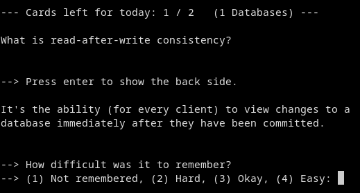

# Markdown Flashcards (`mdfc`)

Easily create and study flashcards using a markdown file and `mdfc`. The command allows you to learn in the terminal through spaced repetition.



If you have worked with Anki before (especially across multiple platforms), you might know how tedious it can be to create flashcards, to tag them, to format them, and also to browse them. I don't want to get overwhelmed by the tool. I just want to reliably learn stuff that is not simple vocabulary. And what could be easier than writing questions and answers in a markdown file?

## Features

- Reliable formatting for your flashcards using markdown
- An adapted Leitner system with 4 difficulty levels instead of a binary system
- The ability to study cards from one topic or all topics at once
- The option to study cards in sequential or random order
- Test mode, which allows you to test yourself with a number of random cards

## Markdown Schema

`mdfc` automatically creates and updates the metadata of your flashcards. The following schema shows how the metadata is stored in the file:

```
# <category>

## <front_side>

<back_side>

`mdfc;box:<box>;due:<due_date>;`
```

An example file could look like the following. And btw, if you use a decent Markdown editor the file won't look so messy anymore thanks to the syntax highlighting 🌈

```
# 1 Databases

## What does ACID stand for?

- Atomicity: transaction's operations are either all executed or none
- Consistency: database always respects all constraints
- Isolation: concurrent transactions do not interfere with each other
- Durability: once a transaction has been committed, it is permanent

## What is read-after-write consistency?

It's the ability (for every client) to view changes to a database immediately after they have been committed.
```

## Installation

Go to [releases](https://github.com/bttger/markdown-flashcards/releases) and download the latest version for your platform. (Optional) Move the executable to a directory that is in your `PATH`. On Linux, you can use the following command: `sudo mv mdfc /usr/local/bin`.

```bash
# Run the executable
$ mdfc ./path/to/flashcards.md
$ mdfc -h
Usage: mdfc [options] [file]

Options:

	-h, --help
		Show this help message and exit.

	-s, --sequential
		Show flashcards in sequential order as in the markdown file. The default behavior is to
		show flashcards in random order.

	-o, --show-category
		Show the category of each flashcard.

	-c, --category <category>
		Show only flashcards of the specified category. A category is a first-level heading in the
		markdown file. A category can be specified by a case-insensitive prefix of the heading.
		If no category is specified, you can interactively choose one.

	-t, --test <number_flashcards>
		Test yourself in test mode with random flashcards. If no number is specified, all
		flashcards will be shown. Possible to combine with -c, --category.

	-n, --number <number_flashcards>
		Learn n cards during the session. If no number is specified, it will fall back to the
		number specified in the YAML front matter of the markdown file. Defaults to 20.

	-f, --future-days-due <days>
		Usually a flashcard is due on a particular date. If you want to learn flashcards
		before they are due, you can specify the number of days in the future when a flashcard
		should be due. This might be helpful in the case when you have no cards due for today's
		learning session. Cards where the due date was missed will be added anyway. Defaults to 0.

	-w, --wrap-lines <line_length>
		Wrap lines to a maximum length. Only breaks lines at whitespaces. Defaults to terminal width.
```

Usually, my default command that I run is `mdfc -o -w 80 ./flashcards.md`. This shows the category of each flashcard and wraps lines at 80 characters.

## Open features

The MVP is done so far, and you can study and test yourself. But of course development is never done. Here are some ideas for the future:

- [ ] Git integration: commit changes to the flashcard file after a learning session
- [ ] Flag: Reset boxes to 0 for all cards
- [ ] YAML front matter: Specify NumberCards and boxIntervals (the latter's default value probably needs some empirical testing)
- [ ] Provide distro packages
- [ ] Update a card during a session if the user changes the file in the background
- [ ] Beautify the console output

## Maybe inspiration for the future

- https://blog.duolingo.com/how-we-learn-how-you-learn/
- https://research.duolingo.com/papers/settles.acl16.pdf
- https://www.pnas.org/doi/10.1073/pnas.1815156116
- https://github.com/st3v3nmw/obsidian-spaced-repetition
